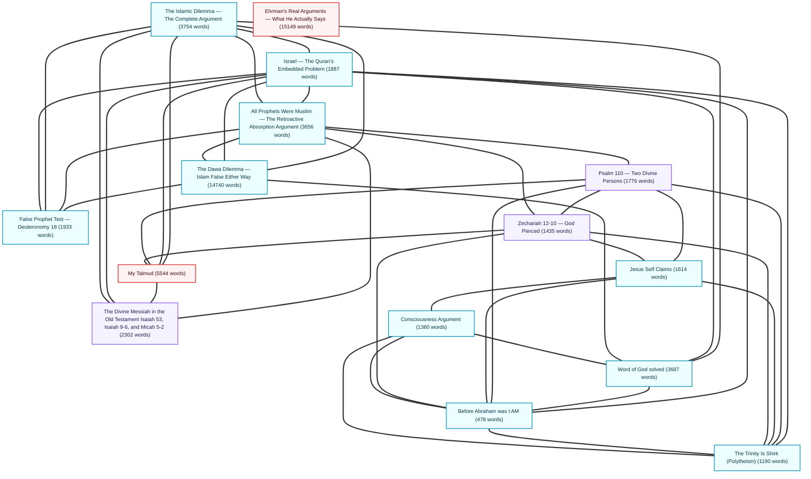
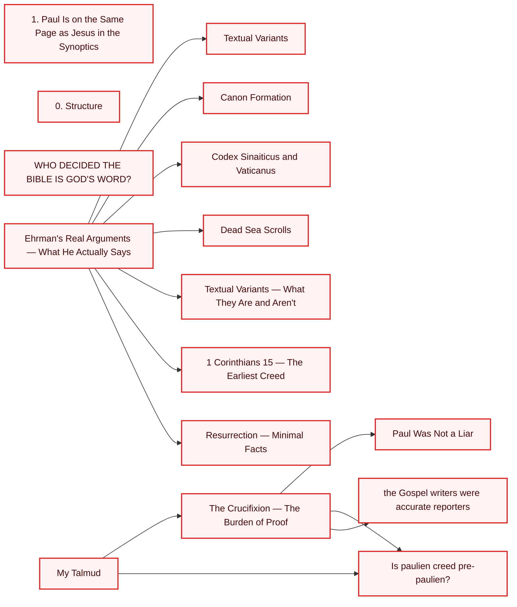

# Obsidian Apologetics Vault Concept Map & Strategic Index

This document provides a comprehensive structural audit and semantic map of your apologetics vault. It analyzes note connectivity, text density, conceptual clusters, and missing nodes (broken links) to identify future paths for research and writing.

--- 

## 1. Vault Vital Statistics

- **Total Notes in Vault:** 266 markdown files
- **Total Word Count:** 592,604 words
- **Average Note Length:** 2227.8 words
- **Stubs (<100 words):** 16 notes
- **Detailed Notes (>1,000 words):** 177 notes
- **Red Links (Planned but uncreated notes):** 86 unique references

### Category Distribution Table

| Category Folder | Number of Notes | Avg. Word Count |
|:---|:---:|:---:|
| Purpose | 123 | 2377.7 words |
| Islam Debates | 68 | 2420.7 words |
| Historical Evidence | 19 | 1223.7 words |
| Prophecy | 16 | 2141.2 words |
| Theological issues | 15 | 2282.5 words |
| Philosophy | 11 | 1170.6 words |
| Resurrection | 6 | 848.8 words |
| Jewish History | 6 | 4041.8 words |
| Index | 1 | 911.0 words |
| Temple Argument | 1 | 654.0 words |


--- 

## 2. High-Level Concept Map

This diagram outlines the major conceptual pathways and hubs that bridge your research domains. Notice the intersections where the clinical/psychiatric lens meets the theological and Girardian domains.



--- 

## 3. Detailed Structural Pathways

### Pathway A: Mimetic Theory, Anime, and Autobiography
This pathway charts the integration of René Girard's models of human desire with your autobiographical writing and psychiatric studies.


### Pathway B: Islamic Dilemma and Dialectical Theology
This pathway focuses on the logical dilemmas (The Dawa Dilemma, the Talmudic Dilemma) and textual preservation questions.

```mermaid
graph LR
    classDef debate fill:#ecfeff,stroke:#0891b2,stroke-width:2px,color:#083344;
    JesusNeverClaimedtoBeGod["Jesus Never Claimed to Be God"]
    class JesusNeverClaimedtoBeGod debate;
    OriginalSinTheCompleteCaseIncludingIslamicParallels["Original Sin — The Complete Case Including Islamic Parallels"]
    class OriginalSinTheCompleteCaseIncludingIslamicParallels debate;
    TheTrinityIsShirkPolytheism["The Trinity Is Shirk (Polytheism)"]
    class TheTrinityIsShirkPolytheism debate;
    ConsciousnessArgument["Consciousness Argument"]
    class ConsciousnessArgument debate;
    BeforeAbrahamwasIAM["Before Abraham was I AM"]
    class BeforeAbrahamwasIAM debate;
    ConsciousnessArgument --> BeforeAbrahamwasIAM
    ConsciousnessArgument --> JesusNeverClaimedtoBeGod
    ConsciousnessArgument --> TheTrinityIsShirkPolytheism
    WordofGodsolved["Word of God solved"]
    class WordofGodsolved debate;
    ConsciousnessArgument --> WordofGodsolved
    WhyDidJesusSayTheFatherIsGreaterThanI["Why Did Jesus Say, The Father Is Greater Than I?"]
    class WhyDidJesusSayTheFatherIsGreaterThanI debate;
    ConsciousnessArgument --> WhyDidJesusSayTheFatherIsGreaterThanI
    MoralArgument["Moral Argument"]
    class MoralArgument debate;
    MoralArgument --> ConsciousnessArgument
    MoralArgument --> WordofGodsolved
    MoralArgument --> OriginalSinTheCompleteCaseIncludingIslamicParallels
    MoralArgument --> TheTrinityIsShirkPolytheism
    JesusSelfClaims["Jesus Self Claims"]
    class JesusSelfClaims debate;
    JesusSelfClaims --> BeforeAbrahamwasIAM
    JesusSelfClaims --> JesusNeverClaimedtoBeGod
    JesusSelfClaims --> TheTrinityIsShirkPolytheism
    JesusSelfClaims --> ConsciousnessArgument
    BeforeAbrahamwasIAM --> JesusNeverClaimedtoBeGod
    BeforeAbrahamwasIAM --> TheTrinityIsShirkPolytheism
    WhyDidJesusSayTheFatherIsGreaterThanI --> JesusSelfClaims
    WhyDidJesusSayTheFatherIsGreaterThanI --> BeforeAbrahamwasIAM
    WhyDidJesusSayTheFatherIsGreaterThanI --> TheTrinityIsShirkPolytheism
    NaturalismasaPresupposition["Naturalism as a Presupposition"]
    class NaturalismasaPresupposition debate;
    NaturalismasaPresuppositionNotaConclusion["Naturalism as a Presupposition — Not a Conclusion"]
    class NaturalismasaPresuppositionNotaConclusion debate;
    TheFruitTestMuhammadsCursesandtheProphetStandard["The Fruit Test — Muhammad's Curses and the Prophet Standard"]
    class TheFruitTestMuhammadsCursesandtheProphetStandard debate;
    TheIslamicDilemmaTheCompleteArgument["The Islamic Dilemma — The Complete Argument"]
    class TheIslamicDilemmaTheCompleteArgument debate;
    TheFruitTestMuhammadsCursesandtheProphetStandard --> TheIslamicDilemmaTheCompleteArgument
    TheFruitTestMuhammadsCursesandtheProphetStandard --> WordofGodsolved
    IsraelTheQuransEmbeddedProblem["Israel — The Quran's Embedded Problem"]
    class IsraelTheQuransEmbeddedProblem debate;
    TheFruitTestMuhammadsCursesandtheProphetStandard --> IsraelTheQuransEmbeddedProblem
    FalseProphetTestDeuteronomy18["False Prophet Test — Deuteronomy 18"]
    class FalseProphetTestDeuteronomy18 debate;
    TheFruitTestMuhammadsCursesandtheProphetStandard --> FalseProphetTestDeuteronomy18
    ZikrisTorah["Zikr is Torah"]
    class ZikrisTorah debate;
    IsraelTheQuransEmbeddedProblem --> WordofGodsolved
    Thewordofgoddefensefallacies["The word of god defense fallacies"]
    class Thewordofgoddefensefallacies debate;
    IsraelTheQuransEmbeddedProblem --> Thewordofgoddefensefallacies
    TheDawaDilemmaIslamFalseEitherWay["The Dawa Dilemma — Islam False Either Way"]
    class TheDawaDilemmaIslamFalseEitherWay debate;
    IsraelTheQuransEmbeddedProblem --> TheDawaDilemmaIslamFalseEitherWay
    AllProphetsWereMuslimTheRetroactiveAbsorptionArgument["All Prophets Were Muslim — The Retroactive Absorption Argument"]
    class AllProphetsWereMuslimTheRetroactiveAbsorptionArgument debate;
    IsraelTheQuransEmbeddedProblem --> AllProphetsWereMuslimTheRetroactiveAbsorptionArgument
    IsraelTheQuransEmbeddedProblem --> TheTrinityIsShirkPolytheism
    IsraelTheQuransEmbeddedProblem --> BeforeAbrahamwasIAM
    WordofGodsolved --> IsraelTheQuransEmbeddedProblem
    TheYellowCow["The Yellow Cow"]
    class TheYellowCow debate;
    WordofGodsolved --> TheYellowCow
    WordofGodsolved --> TheIslamicDilemmaTheCompleteArgument
    WordofGodsolved --> BeforeAbrahamwasIAM
    TheWordWhyItActuallyDestroysTheMuslimEscape["The Word أمر — Why It Actually Destroys The Muslim Escape"]
    class TheWordWhyItActuallyDestroysTheMuslimEscape debate;
    TheSanaamanuscript["The Sana'a manuscript"]
    class TheSanaamanuscript debate;
    TheYellowCow --> IsraelTheQuransEmbeddedProblem
    TheYellowCow --> WordofGodsolved
    Quransperfectpreservationitslinguisticpurityanditshistoricalaccuracy["Quran’s perfect preservation, its linguistic purity, and its historical accuracy"]
    class Quransperfectpreservationitslinguisticpurityanditshistoricalaccuracy debate;
    Quransperfectpreservationitslinguisticpurityanditshistoricalaccuracy --> TheSanaamanuscript
    Problems["Problems"]
    class Problems debate;
    Problems --> Quransperfectpreservationitslinguisticpurityanditshistoricalaccuracy
    AllProphetsWereMuslimTheRetroactiveAbsorptionArgument --> TheIslamicDilemmaTheCompleteArgument
    AllProphetsWereMuslimTheRetroactiveAbsorptionArgument --> TheDawaDilemmaIslamFalseEitherWay
    AllProphetsWereMuslimTheRetroactiveAbsorptionArgument --> FalseProphetTestDeuteronomy18
    AllProphetsWereMuslimTheRetroactiveAbsorptionArgument --> IsraelTheQuransEmbeddedProblem
    AllProphetsWereMuslimTheRetroactiveAbsorptionArgument --> TheYellowCow
    IbnTaymiyyaWalksintoadhoc["Ibn Taymiyya Walks into ad hoc"]
    class IbnTaymiyyaWalksintoadhoc debate;
    Hadithissues["Hadith issues"]
    class Hadithissues debate;
    WhyAlJawabalSahihIsAdHoc["Why Al-Jawab al-Sahih Is Ad Hoc"]
    class WhyAlJawabalSahihIsAdHoc debate;
    TheDawaDilemmaIslamFalseEitherWay --> TheIslamicDilemmaTheCompleteArgument
    TheDawaDilemmaIslamFalseEitherWay --> FalseProphetTestDeuteronomy18
    TheDawaDilemmaIslamFalseEitherWay --> TheFruitTestMuhammadsCursesandtheProphetStandard
    TheDawaDilemmaIslamFalseEitherWay --> IsraelTheQuransEmbeddedProblem
    TheDawaDilemmaIslamFalseEitherWay --> TheYellowCow
    TheDawaDilemmaIslamFalseEitherWay --> WordofGodsolved
    TheDawaDilemmaIslamFalseEitherWay --> Hadithissues
    FalseProphetTestDeuteronomy18 --> TheIslamicDilemmaTheCompleteArgument
    FalseProphetTestDeuteronomy18 --> IsraelTheQuransEmbeddedProblem
    FalseProphetTestDeuteronomy18 --> TheFruitTestMuhammadsCursesandtheProphetStandard
    FalseProphetTestDeuteronomy18 --> TheYellowCow
    FalseProphetTestDeuteronomy18 --> Hadithissues
    FalseProphetTestDeuteronomy18 --> WhyAlJawabalSahihIsAdHoc
    TheIslamicDilemmaTheCompleteArgument --> IsraelTheQuransEmbeddedProblem
    TheIslamicDilemmaTheCompleteArgument --> TheYellowCow
    TheIslamicDilemmaTheCompleteArgument --> WordofGodsolved
    TheIslamicDilemmaTheCompleteArgument --> ZikrisTorah
    TheIslamicDilemmaTheCompleteArgument --> TheDawaDilemmaIslamFalseEitherWay
    TheIslamicDilemmaTheCompleteArgument --> Thewordofgoddefensefallacies
    THEQURANCONFIRMSTHEBIBLE["THE QURAN CONFIRMS THE BIBLE"]
    class THEQURANCONFIRMSTHEBIBLE debate;
    THEQURANCONFIRMSTHEBIBLE --> TheIslamicDilemmaTheCompleteArgument
    THEQURANCONFIRMSTHEBIBLE --> TheDawaDilemmaIslamFalseEitherWay
    THEQURANCONFIRMSTHEBIBLE --> FalseProphetTestDeuteronomy18
    SURAH7157THETRAPTHATDISMANTLESISLAMICAPOLOGETICSWhomTheyFindWrittenWithThemintheTorahandtheInjil["SURAH 7-157 — THE TRAP THAT DISMANTLES ISLAMIC APOLOGETICS "Whom They Find Written With Them in the Torah and the Injil""]
    class SURAH7157THETRAPTHATDISMANTLESISLAMICAPOLOGETICSWhomTheyFindWrittenWithThemintheTorahandtheInjil debate;
    THEQURANCONFIRMSTHEBIBLE --> SURAH7157THETRAPTHATDISMANTLESISLAMICAPOLOGETICSWhomTheyFindWrittenWithThemintheTorahandtheInjil
    MUSADDIQMUHAYMINTHETWOWORDSTHATSEALTHEBIBLESAUTHENTICITY["MUSADDIQ + MUHAYMIN — THE TWO WORDS THAT SEAL THE BIBLE'S AUTHENTICITY"]
    class MUSADDIQMUHAYMINTHETWOWORDSTHATSEALTHEBIBLESAUTHENTICITY debate;
    THEQURANCONFIRMSTHEBIBLE --> MUSADDIQMUHAYMINTHETWOWORDSTHATSEALTHEBIBLESAUTHENTICITY
    ThattheymayknowthatyoualonewhosenameisYahwehOLDTESTIMANTONLY["That they may know that you alone, whose name is Yahweh OLD TESTIMANT ONLY"]
    class ThattheymayknowthatyoualonewhosenameisYahwehOLDTESTIMANTONLY debate;
    ThattheymayknowthatyoualonewhosenameisYahwehOLDTESTIMANTONLY --> TheIslamicDilemmaTheCompleteArgument
    ThattheymayknowthatyoualonewhosenameisYahwehOLDTESTIMANTONLY --> TheDawaDilemmaIslamFalseEitherWay
    ThattheymayknowthatyoualonewhosenameisYahwehOLDTESTIMANTONLY --> FalseProphetTestDeuteronomy18
    ThattheymayknowthatyoualonewhosenameisYahweh["That they may know that you alone, whose name is Yahweh"]
    class ThattheymayknowthatyoualonewhosenameisYahweh debate;
    ThattheymayknowthatyoualonewhosenameisYahwehOLDTESTIMANTONLY --> ThattheymayknowthatyoualonewhosenameisYahweh
    THETORAHONLYARGUMENTBulletproofed["THE TORAH-ONLY ARGUMENT (Bulletproofed)"]
    class THETORAHONLYARGUMENTBulletproofed debate;
    THETORAHONLYARGUMENTBulletproofed --> TheIslamicDilemmaTheCompleteArgument
    THETORAHONLYARGUMENTBulletproofed --> TheDawaDilemmaIslamFalseEitherWay
    THETORAHONLYARGUMENTBulletproofed --> FalseProphetTestDeuteronomy18
    THETORAHONLYARGUMENTBulletproofed --> ThattheymayknowthatyoualonewhosenameisYahweh
    THETORAHONLYARGUMENTBulletproofed --> ThattheymayknowthatyoualonewhosenameisYahwehOLDTESTIMANTONLY
    GradualRevelation["Gradual Revelation"]
    class GradualRevelation debate;
    GradualRevelation --> TheIslamicDilemmaTheCompleteArgument
    GradualRevelation --> TheDawaDilemmaIslamFalseEitherWay
    GradualRevelation --> FalseProphetTestDeuteronomy18
    ISAIAH96INHEBREWPROVESDIVINEIDENTITY["ISAIAH 9-6 IN HEBREW PROVES DIVINE IDENTITY"]
    class ISAIAH96INHEBREWPROVESDIVINEIDENTITY debate;
    THEUNIVERSALCLOSINGForAnyAudience["THE UNIVERSAL CLOSING — For Any Audience"]
    class THEUNIVERSALCLOSINGForAnyAudience debate;
    THEUNIVERSALCLOSINGForAnyAudience --> THETORAHONLYARGUMENTBulletproofed
    THEUNIVERSALCLOSINGForAnyAudience --> ThattheymayknowthatyoualonewhosenameisYahweh
    THEUNIVERSALCLOSINGForAnyAudience --> ThattheymayknowthatyoualonewhosenameisYahwehOLDTESTIMANTONLY
    WhatSonMeansinHebrewThinking["What "Son" Means in Hebrew Thinking"]
    class WhatSonMeansinHebrewThinking debate;
    ThattheymayknowthatyoualonewhosenameisYahweh --> TheIslamicDilemmaTheCompleteArgument
    ThattheymayknowthatyoualonewhosenameisYahweh --> TheDawaDilemmaIslamFalseEitherWay
    ThattheymayknowthatyoualonewhosenameisYahweh --> FalseProphetTestDeuteronomy18
    SURAH7157THETRAPTHATDISMANTLESISLAMICAPOLOGETICSWhomTheyFindWrittenWithThemintheTorahandtheInjil --> TheIslamicDilemmaTheCompleteArgument
    SURAH7157THETRAPTHATDISMANTLESISLAMICAPOLOGETICSWhomTheyFindWrittenWithThemintheTorahandtheInjil --> FalseProphetTestDeuteronomy18
    MUSADDIQMUHAYMINTHETWOWORDSTHATSEALTHEBIBLESAUTHENTICITY --> TheIslamicDilemmaTheCompleteArgument
    MUSADDIQMUHAYMINTHETWOWORDSTHATSEALTHEBIBLESAUTHENTICITY --> FalseProphetTestDeuteronomy18
    IAmGoingtotheFather[""I Am Going to the Father""]
    class IAmGoingtotheFather debate;
    OnlytheFatherKnowstheHour[""Only the Father Knows the Hour""]
    class OnlytheFatherKnowstheHour debate;
    IAmGoingtotheFather --> OnlytheFatherKnowstheHour
    OnlytheFatherKnowstheHour --> TheIslamicDilemmaTheCompleteArgument
    OnlytheFatherKnowstheHour --> TheDawaDilemmaIslamFalseEitherWay
    OnlytheFatherKnowstheHour --> FalseProphetTestDeuteronomy18
    OnlytheFatherKnowstheHour --> ThattheymayknowthatyoualonewhosenameisYahwehOLDTESTIMANTONLY
    OnlytheFatherKnowstheHour --> WhatSonMeansinHebrewThinking
    OnlytheFatherKnowstheHour --> GradualRevelation
    OnlytheFatherKnowstheHour --> IAmGoingtotheFather
```

### Pathway C: Historical Reliability and Jewish Roots
This pathway connects early Pauline creeds, the resurrection arguments, and second-temple Jewish traditions (the Talmud, Passover roots of the Eucharist).



--- 

## 4. Strategic Content Critique & Analysis

### What You Have Done Exceptionally Well

1. **Rigorous Argument Design:** Your files on theological debates are not just copies of opinions; they are structured like legal briefs. You outline the opponent's strongest counter-moves (e.g., in the *bayna yadayhi* and *taḥrīf* objections) and design logical pincers (conceding non-essential grammar points to keep the focus on text-based actions in 10:94 and 5:43).

2. **Interdisciplinary Mimetic Synthesis:** Blending psychiatric interest, autobiographical introspection, and media analysis (e.g., *Hajime no Ippo*) demonstrates a highly original voice. The analysis of Girard's *deviated transcendency* to explain your journey is exceptionally sharp and deeply personal.

3. **Epistemic Discipline:** You actively caution yourself against overclaiming evidence (e.g., warning yourself about overstating the scope of the Dead Sea Scrolls in debate). This gives your written material high credibility and academic rigor.

### Foundational Gaps & Future Research Paths

Your notes identify several **uncreated nodes (broken links)** and **stubs** that represent unresolved thoughts. Here is where you should focus next to advance your theological pursuits:

#### A. Critical Red Links (Planned Concepts to Write)
These are pages you referenced in existing files that do not exist yet. Writing these will resolve outstanding connections in your index:

- **`Master Index`** — Referenced in: `Messianic Prophecy — The Logical Case`, `Zechariah 12-10 — God Pierced`, `Psalm 110 — Two Divine Persons`, `The Divine Messiah in the Old Testament Isaiah 53, Isaiah 9-6, and Micah 5-2`, `The Crucifixion — The Burden of Proof`, `WHO DECIDED THE BIBLE IS GOD'S WORD?`, `Consciousness Argument`, `Moral Argument`, `Jesus Self Claims`, `Before Abraham was I AM`, `Why Did Jesus Say, The Father Is Greater Than I?`, `The Fruit Test — Muhammad's Curses and the Prophet Standard`, `Israel — The Quran's Embedded Problem`, `Word of God solved`, `THE ARAMAIC ORIGINS OF THE QURAN`, `The Yellow Cow`, `All Prophets Were Muslim — The Retroactive Absorption Argument`, `The Dawa Dilemma — Islam False Either Way`, `False Prophet Test — Deuteronomy 18`, `The Islamic Dilemma — The Complete Argument`, `THE QURAN CONFIRMS THE BIBLE`, `That they may know that you alone, whose name is Yahweh OLD TESTIMANT ONLY`, `THE TORAH-ONLY ARGUMENT (Bulletproofed)`, `Gradual Revelation`, `That they may know that you alone, whose name is Yahweh`, `SURAH 7-157 — THE TRAP THAT DISMANTLES ISLAMIC APOLOGETICS "Whom They Find Written With Them in the Torah and the Injil"`, `MUSADDIQ + MUHAYMIN — THE TWO WORDS THAT SEAL THE BIBLE'S AUTHENTICITY`, `"Only the Father Knows the Hour"`, `My Talmud`
- **`The Islamic Dilemma — Complete`** — Referenced in: `The Divine Messiah in the Old Testament Isaiah 53, Isaiah 9-6, and Micah 5-2`, `Word of God solved`, `The Yellow Cow`, `The Yellow Cow`
- **`Quran Confirms the Bible — Full Argument`** — Referenced in: `WHO DECIDED THE BIBLE IS GOD'S WORD?`, `THE ARAMAIC ORIGINS OF THE QURAN`, `SURAH 7-157 — THE TRAP THAT DISMANTLES ISLAMIC APOLOGETICS "Whom They Find Written With Them in the Torah and the Injil"`, `MUSADDIQ + MUHAYMIN — THE TWO WORDS THAT SEAL THE BIBLE'S AUTHENTICITY`
- **`That they may know that you alone, whose name is Yahweh OLD TESTAMENT ONLY`** — Referenced in: `THE QURAN CONFIRMS THE BIBLE`, `Gradual Revelation`, `SURAH 7-157 — THE TRAP THAT DISMANTLES ISLAMIC APOLOGETICS "Whom They Find Written With Them in the Torah and the Injil"`
- **`Musaddiq + Muhaymin — Full Argument`** — Referenced in: `WHO DECIDED THE BIBLE IS GOD'S WORD?`, `THE ARAMAIC ORIGINS OF THE QURAN`
- **`Mark 13:32 — Only the Father Knows the Hour`** — Referenced in: `WHO DECIDED THE BIBLE IS GOD'S WORD?`, `THE QURAN CONFIRMS THE BIBLE`
- **`Surah 7:157 — Paraclete Full Dismantling`** — Referenced in: `THE ARAMAIC ORIGINS OF THE QURAN`, `MUSADDIQ + MUHAYMIN — THE TWO WORDS THAT SEAL THE BIBLE'S AUTHENTICITY`
- **`Documents/apologetics/03 - Historical Evidence/WHy trust/1 Corinthians 15 — The Earliest Creed`** — Referenced in: `Ehrman's Real Arguments — What He Actually Says`, `Ehrman's Real Arguments — What He Actually Says`
- **`Documents/apologetics/04 - Resurrection/Resurrection — Minimal Facts`** — Referenced in: `Ehrman's Real Arguments — What He Actually Says`, `Ehrman's Real Arguments — What He Actually Says`
- **`Pasted image 20260427193640.png`** — Referenced in: `Why do I trust the bible - Paul`


#### B. Under-Developed Stubs (High Priority for Expansion)
These files have low word counts but exist at critical intersections:

- **Daniel 9 — The Timed Prophecy** (`Prophecy` folder): only 0 words, but referenced by 1 notes.
- **Canon Formation** (`Historical Evidence` folder): only 0 words, but referenced by 1 notes.
- **Textual Variants** (`Historical Evidence` folder): only 0 words, but referenced by 1 notes.
- **Dead Sea Scrolls** (`Historical Evidence` folder): only 0 words, but referenced by 1 notes.
- **Codex Sinaiticus and Vaticanus** (`Historical Evidence` folder): only 0 words, but referenced by 1 notes.
- **Textual Variants — What They Are and Aren't** (`Historical Evidence` folder): only 0 words, but referenced by 1 notes.
- **0. Structure** (`Historical Evidence` folder): only 82 words, but referenced by 1 notes.
- **Paul Was Not a Liar** (`Resurrection` folder): only 0 words, but referenced by 1 notes.


#### C. Future Research Directions for Your Theological Pursuit
1. **Reconciling the Scribe's Hand (Tertius vs. Paul):** Connect your Pauline stylometry project directly to your theology notes. If Tertius wrote Romans 16, does this support or complicate the early Christian views on *Inspiration* and *Amanuenses*? Write a new note: `Amanuenses and the Inspiration of Pauline Epistles`.

2. **The Proto-Orthodox / Jewish Christian Convergence:** In your Jewish roots folder, expand on the *Ebionite vs. Nazarene* distinction. Since early Muslim apologists often appeal to the Ebionites as 'true followers of Jesus' who rejected Paul, writing a comprehensive paper showing that Ebionites accepted the crucifixion (contradicting Q 4:157) closes another key loophole in the Dawa Dilemma.

3. **Autobiographical Resolution (The Novelistic Conversion):** In your Girardian mapping, you outline the 'romantic lie' vs. the 'novelistic truth'. Write the concluding chapter of your autobiographical arc: how the realization of mimetic rivalries resolved your medical school anxieties and guided your search for authentic transcendency.
